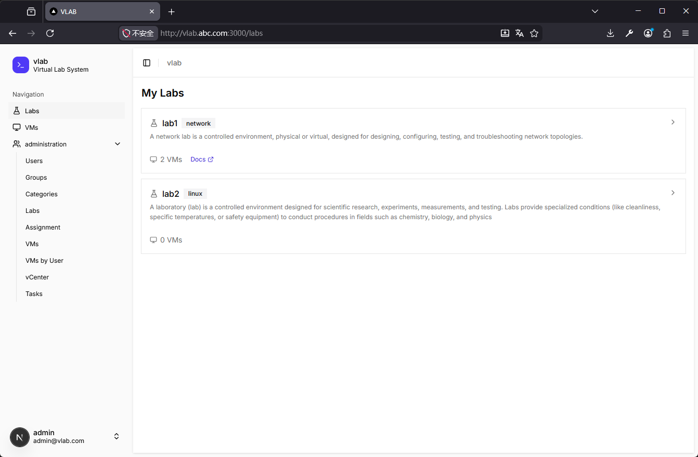
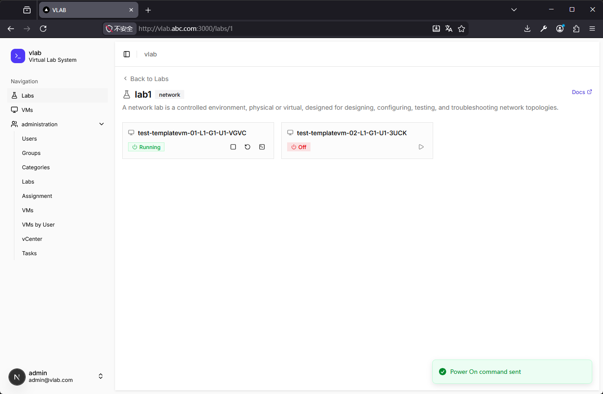
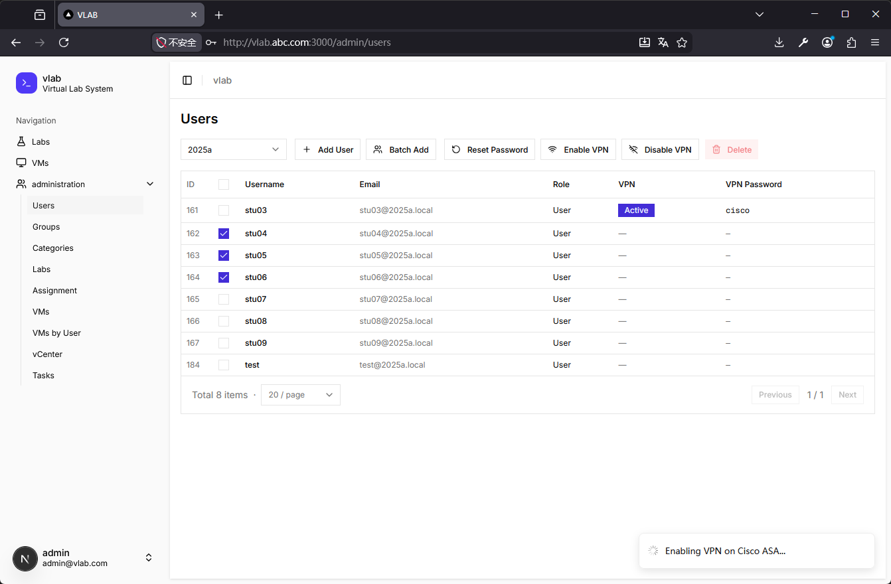
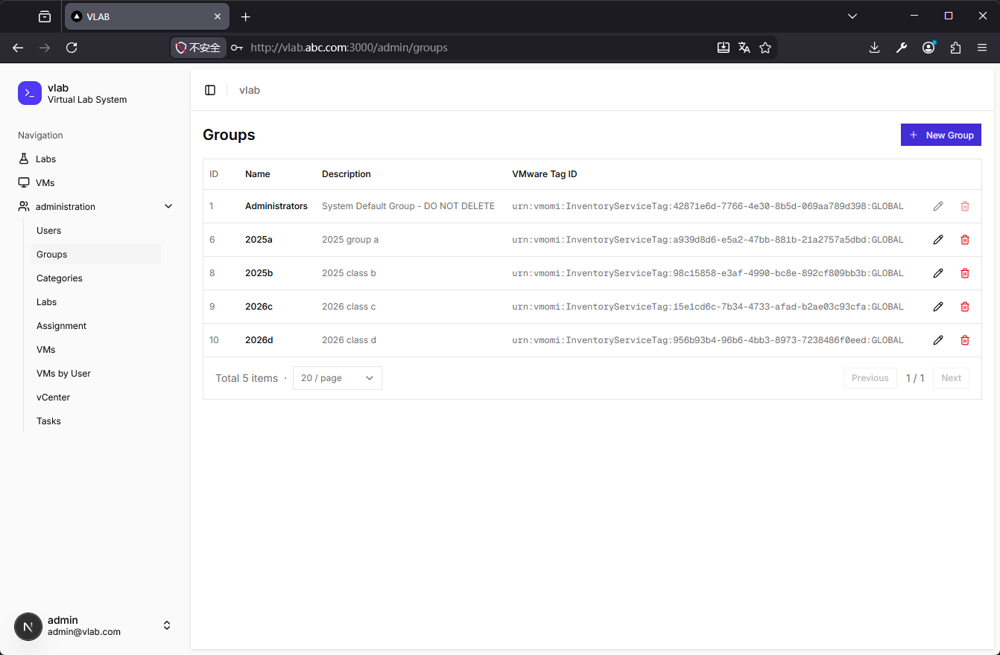
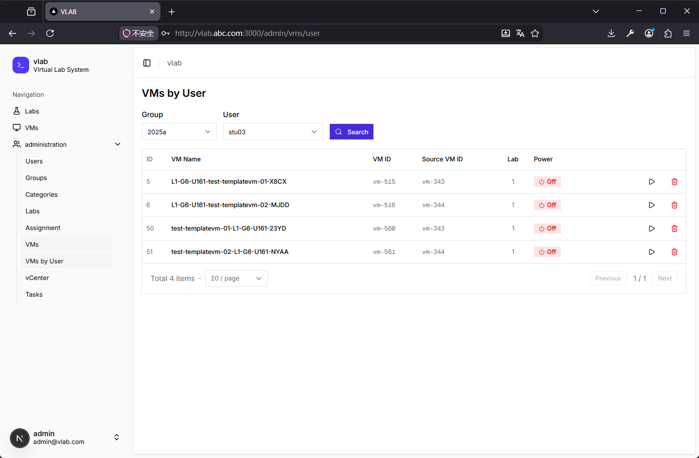
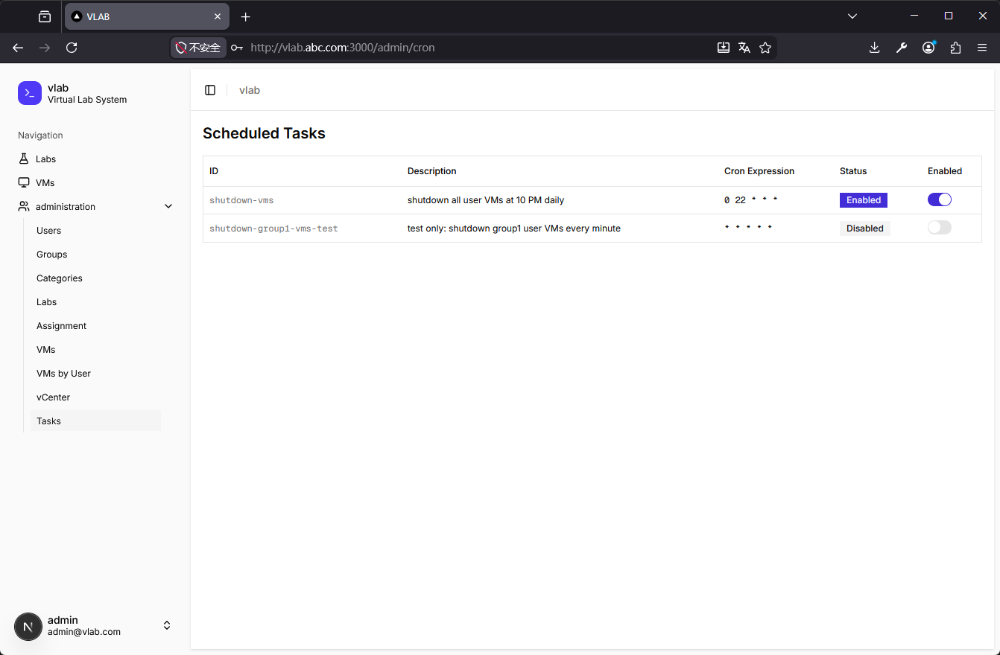
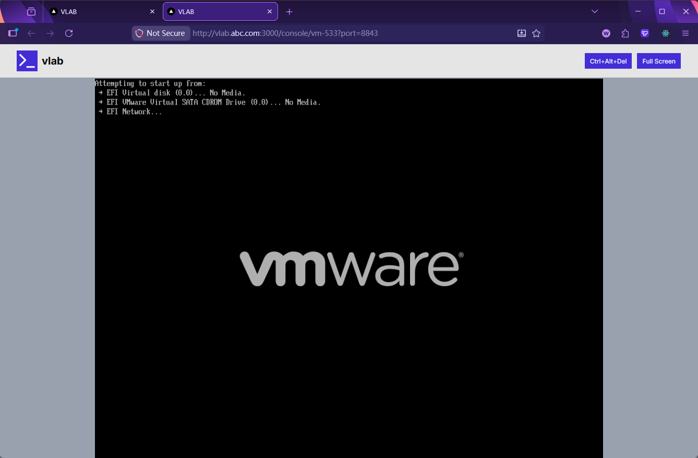

# VLab - Virtual Lab Platform

An education and training virtual lab platform built on VMware vCenter, allowing users to access and operate assigned virtual machines directly from a web browser.

VLab 2.0 is a full-stack rewrite of the original 1.0 version. Version 1.0 was built with Express.js, EJS, and vanilla JavaScript, and relied on a Python-based Netmiko + Flask bridge for ASA communication. In 2.0, the backend was fully rewritten with Express.js, removing the Python dependency, adding a built-in VM console proxy, and introducing a highly automated integration layer so a single API call can trigger end-to-end workflows such as VM clone/delete and user/group create/delete operations. In development mode, the backend enables full debug logging to make troubleshooting easier. The frontend is built with Next.js, and complex background tasks are handled through streaming APIs that push progress updates from the backend to improve the user experience.

---

## English

## Project Goal

VLab is designed for enterprise training and vocational education scenarios. It enables administrators to quickly provision VM-based lab environments for users. Learners can connect to VM consoles directly in a browser without installing client software. The platform covers the full workflow: lab template definition, user group assignment, batch VM cloning, and VPN account provisioning.

---

## Features

### Administrator Features

- User and group management: create user accounts and assign users to groups
- Lab management: define labs, configure categories, and select template VMs
- Lab assignment: assign labs to target groups and trigger batch cloning; cloned VMs are tagged by group for easier vCenter management
- VM management: view VMs by group or by user, and perform power on/off/restart/delete operations
- vCenter browser: browse datacenters, clusters, hosts, and datastore trees online
- Scheduled tasks: configure cron tasks (for example, timed shutdown and expired VM cleanup)

### User Features

- My VMs: view all assigned VMs and control power state
- Labs: browse available lab catalog
- Console access: open fullscreen VM console and operate in real time via WMKS

### Other Capabilities

- JWT authentication with automatic access-token refresh
- Long-running operations (clone, batch delete) streamed via NDJSON, with real-time toast updates in frontend
- Cisco ASA integration: auto create/delete VPN accounts

---

## Tech Stack

| Layer          | Technology                                       |
| -------------- | ------------------------------------------------ |
| Frontend       | Next.js 16, React 19, Tailwind CSS v4, shadcn/ui |
| Backend        | Node.js, Express 5, TypeScript                   |
| Database       | PostgreSQL 17                                    |
| Virtualization | VMware vCenter REST API, WMKS console protocol   |
| Network        | Cisco ASA SSH, WebSocket proxy                   |
| Deployment     | Nginx (HTTPS reverse proxy), Docker Compose      |

---

## Architecture

```
Browser
  |
  +- HTTPS (443) --> Nginx reverse proxy
  |                    |
  |                    +- /api/*  --> Backend :8800 (Express REST API)
  |                    +- /*      --> Frontend :3000 (Next.js)
  |                    +- /esxi/* --> ESXi host (WebSocket console pass-through)
  |
  +- WSS (8843) --> Backend built-in WebSocket proxy --> ESXi WMKS endpoint
```

### Backend (backend/)

Runtime ports: 8800 (REST API) + 8843 (built-in WebSocket proxy)

```
src/
|- routes/          # API routes (auth / users / groups / labs / vms / assign / cron / vmware)
|- services/
|  |- vcenter/      # vCenter REST wrappers (clone, power, console ticket)
|  |- asa/          # Cisco ASA SSH client for VPN account management
|  |- proxy/        # Built-in HTTPS WebSocket proxy to ESXi console endpoint
|  |- cron/         # Scheduled task management
|- db/
|  |- queries/      # PostgreSQL query wrappers
|- middleware/      # JWT auth, error handling, etc.
|- config/          # Environment configuration loading
```

### Frontend (frontend/)

Runtime port: 3000

```
app/
|- (dashboard)/     # Sidebar layout, authentication required
|  |- admin/        # Admin pages (users, groups, labs, assignments, VMs, vCenter, cron)
|  |- vms/          # User: my VMs
|  |- labs/         # User: lab list
|- console/[id]/    # Fullscreen VM console (WMKS loaded dynamically)
|- auth/            # Login page

components/
|- ui/              # shadcn/ui base components
|- vm-power-badge   # VM power badge, polling + action buttons
|- ...

lib/
|- api.ts           # Fetch wrapper, JWT refresh handling, streaming support
|- utils.ts
```

Key design points:

- API proxy: next.config.ts rewrites /api/\* to backend, no local CORS setup needed
- Streaming toast: streamRequest consumes NDJSON line by line; each step shows a loading toast and then transitions to success/failure
- VM console: WMKS is loaded dynamically on client side and connects through backend WSS proxy for fullscreen remote console

---

## Deployment Layout

```
docker/
|- docker-compose.pg.yml     # PostgreSQL 17 container
|- docker-compose.nginx.yml  # Nginx HTTPS reverse proxy + certificate mount
```

Recommended deployment order in production:

1. Start PostgreSQL container.
2. Build backend and frontend artifacts:

- `cd backend && npm install && npm run build`
- `cd frontend && npm install && npm run build`

3. Deploy service files:

- Copy `deploy/vlab-backend.service` and `deploy/vlab-frontend.service` to `/etc/systemd/system/`

4. Reload and enable services:

- `sudo systemctl daemon-reload`
- `sudo systemctl enable --now vlab-backend`
- `sudo systemctl enable --now vlab-frontend`

5. Start Nginx container (mount SSL certificates).

Notes:

- The service files assume backend is deployed at `/opt/vlab/backend` and frontend at `/opt/vlab/frontend`.
- `node` and `npm` are expected at `/usr/bin/node` and `/usr/bin/npm`.
- Check runtime logs with `journalctl -u vlab-backend -f` and `journalctl -u vlab-frontend -f`.

Recommended production hardware/storage architecture:

1. Server: VMware ESXi 7.0 or newer.
2. Shared storage: SAN or NFS.
3. VAAI (vStorage APIs for Array Integration): to improve VM clone performance, enable VAAI. For NFS storage, install vendor-provided VAAI-NAS plugin (vSphere Installation Bundle, VIB) on ESXi. For SAN storage, VMware usually provides native support, and storage-side firmware declaration is sufficient.
4. Preferred setup: NetApp + NFS with VAAI plugin on ESXi to enable FlexClone. In this mode, VM clone on NFS datastore does not copy VMDK data blocks directly. ESXi sends a CLONE_FILE request (VAAI-NAS primitive) to the array, and the array completes clone by pointer remap or snapshot reference, typically finishing in 1-2 seconds.

---

## Local Development

```bash
# Generate temporary certificates
cd backend/cert
openssl genrsa -out private.key 2048
openssl req -new -key private.key -out certificate.csr
openssl x509 -req -days 3650 -in certificate.csr -signkey private.key -out certificate.crt

# Backend
cd backend
cp .env.example .env   # Fill in vCenter / DB / ASA connection settings
npm install
npm run dev

# Frontend
cd frontend
npm install
npm run dev            # next dev, port 3000
```

---

## Screenshots















## License

MIT License, see [LICENSE](LICENSE).

---

## 中文

## 项目目的

VLab 面向企业内训、职业教育等场景，让管理员能够快速为用户分配虚拟机实验环境，用户无需安装任何客户端，直接在浏览器中连接虚拟机控制台。平台管理从实验模板定义、用户组分配、虚拟机批量克隆，到 VPN 账号下发，全流程覆盖。

VLab 2.0 是对最初 1.0 版本的整体重写。1.0 采用 Express.js、EJS 和原生 JavaScript 构建，ASA 通信则依赖 Python 的 Netmiko + Flask 进行转接。2.0 中，后端使用 Express.js 全面重写，去掉了对 Python 的依赖，新增了内置的 VM console proxy，并引入高度自动化的集成能力，使得单个接口即可驱动后台一系列虚拟机克隆/删除、用户/组创建/删除等操作。开发环境下，后端会默认打开完整的 debug 日志，便于故障排查。前端则使用 Next.js 构建，对于复杂的后台任务，通过流式接口从后端持续获取消息，以提升用户体验。

---

## 功能概览

### 管理员功能

- 用户与分组管理：创建用户账号、将用户分配到组
- 实验室管理：定义实验室，设置实验分类，为实验室选择模板虚拟机
- 实验室分配：将实验室分配给指定的组，触发批量克隆创建虚拟机，克隆的虚拟机会被打上组标记，以方便在 vCenter 中进行管理
- 虚拟机管理：按组或按用户查看 VM 列表，执行开机/关机/重启/删除操作
- vCenter 浏览器：在线浏览 vCenter 数据中心、集群、主机、数据存储树形结构
- 定时任务：配置 cron 任务（如定时关机、清理过期 VM）

### 用户功能

- 我的虚拟机：查看已分配给自己的全部 VM，控制电源状态
- 实验列表：浏览可用的实验目录
- 控制台访问：点击进入全屏 VM 控制台，通过 WMKS 协议实时操作虚拟机

### 其他特性

- JWT 认证，支持 access token 自动刷新
- 长操作（克隆、批量删除）通过 NDJSON 流式推送进度，前端以 Toast 实时展示
- Cisco ASA 集成：自动创建/删除用户 VPN 账号

---

## 技术栈

| 层次   | 技术                                                |
| ------ | --------------------------------------------------- |
| 前端   | Next.js 16 · React 19 · Tailwind CSS v4 · shadcn/ui |
| 后端   | Node.js · Express 5 · TypeScript                    |
| 数据库 | PostgreSQL 17                                       |
| 虚拟化 | VMware vCenter REST API · WMKS 控制台协议           |
| 网络   | Cisco ASA SSH · WebSocket 代理                      |
| 部署   | Nginx（HTTPS 反向代理）· Docker Compose             |

---

## 架构说明

```
浏览器
  |
  +- HTTPS (443) --> Nginx 反向代理
  |                    |
  |                    +- /api/*  --> Backend :8800 (Express REST API)
  |                    +- /*      --> Frontend :3000 (Next.js)
  |                    +- /esxi/* --> ESXi 主机 (WebSocket 控制台直通)
  |
  +- WSS (8843) --> Backend 内置 WebSocket 代理 --> ESXi WMKS 端点
```

### Backend（backend/）

运行端口：8800（REST API）+ 8843（内置 WebSocket 代理）

```
src/
|- routes/          # API 路由（auth / users / groups / labs / vms / assign / cron / vmware）
|- services/
|  |- vcenter/      # vCenter REST API 封装（克隆、电源、控制台票据）
|  |- asa/          # Cisco ASA SSH 连接，管理 VPN 账号
|  |- proxy/        # 内置 HTTPS WebSocket 代理，转发浏览器到 ESXi 控制台
|  |- cron/         # 定时任务调度
|- db/
|  |- queries/      # PostgreSQL 查询封装
|- middleware/      # JWT 鉴权、错误处理等中间件
|- config/          # 环境配置加载
```

### Frontend（frontend/）

运行端口：3000

```
app/
|- (dashboard)/     # 带侧边栏布局，需登录
|  |- admin/        # 管理员页面（用户、组、实验室、作业、VM、vCenter、定时任务）
|  |- vms/          # 用户：我的虚拟机
|  |- labs/         # 用户：实验列表
|- console/[id]/    # 全屏 VM 控制台（动态加载 WMKS 库）
|- auth/            # 登录页

components/
|- ui/              # shadcn/ui 基础组件
|- vm-power-badge   # VM 电源状态徽标，轮询状态 + 操作按钮
|- ...

lib/
|- api.ts           # 封装 fetch，处理 JWT 自动刷新和流式响应
|- utils.ts
```

关键设计点：

- API 代理：next.config.ts 将 /api/\* 转发至后端，本地开发无需跨域配置
- 流式 Toast：streamRequest 逐行消费 NDJSON，每一步显示 loading toast，全部完成后统一替换为成功/失败状态
- VM 控制台：WMKS 库在客户端动态加载，连接后端 WSS 代理隧道，实现全屏远程桌面体验

---

## 软件部署结构及硬件架构

```
docker/
|- docker-compose.pg.yml     # PostgreSQL 17 容器
|- docker-compose.nginx.yml  # Nginx HTTPS 反向代理 + 证书挂载
```

生产环境推荐部署顺序：

1. 启动 PostgreSQL 容器。
2. 构建后端与前端产物：

- `cd backend && npm install && npm run build`
- `cd frontend && npm install && npm run build`

3. 部署服务文件：

- 将 `deploy/vlab-backend.service` 与 `deploy/vlab-frontend.service` 复制到 `/etc/systemd/system/`

4. 重载并启用服务：

- `sudo systemctl daemon-reload`
- `sudo systemctl enable --now vlab-backend`
- `sudo systemctl enable --now vlab-frontend`

5. 启动 Nginx 容器（挂载 SSL 证书）。

说明：

- 服务文件默认后端目录为 `/opt/vlab/backend`，前端目录为 `/opt/vlab/frontend`。
- 运行环境要求 `node` 与 `npm` 分别位于 `/usr/bin/node` 和 `/usr/bin/npm`。
- 可使用 `journalctl -u vlab-backend -f` 与 `journalctl -u vlab-frontend -f` 查看实时日志。

生产环境硬件部署架构：

1. 服务器：建议使用 VMware ESXi 7.0 及以上版本。
2. 集中存储：建议采用 SAN 或 NFS。
3. VAAI（vStorage APIs for Array Integration）支持：为提升 VM 克隆速度，建议启用 VAAI。对于 NFS 存储，可安装厂商提供的 VAAI-NAS 插件（vSphere Installation Bundle，VIB）到 ESXi；对于 SAN 存储，VMware 通常已原生支持，只需存储阵列在固件层面声明支持即可，无需额外插件。
4. 推荐方案：采用 NetApp + NFS，并在 ESXi 上安装 VAAI 插件以启用 FlexClone。这样在 NFS 数据存储上克隆 VM 时，ESXi 无需复制 VMDK 文件，而是向阵列发送 CLONE_FILE 请求（VAAI-NAS 原语）；阵列在文件系统层通过指针重映射或快照引用完成“克隆”，几乎不搬移数据块，通常可在 1-2 秒内完成。

---

## 本地开发

```bash
# 生成临时证书
cd backend/cert
openssl genrsa -out private.key 2048
openssl req -new -key private.key -out certificate.csr
openssl x509 -req -days 3650 -in certificate.csr -signkey private.key -out certificate.crt

# 后端
cd backend
cp .env.example .env   # 填写 vCenter / DB / ASA 连接信息
npm install
npm run dev

# 前端
cd frontend
npm install
npm run dev            # next dev，端口 3000
```

---

## 许可证

MIT 许可，见 [LICENSE](LICENSE)。
